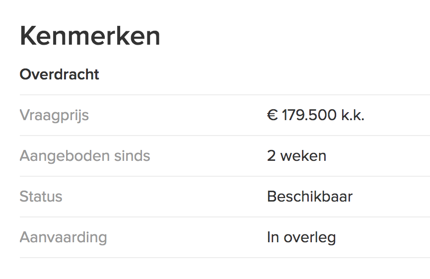
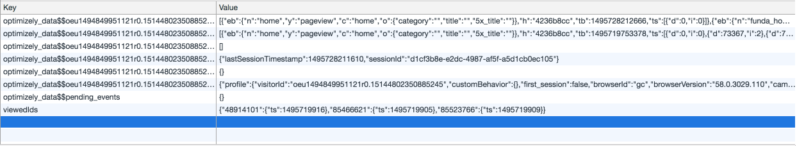
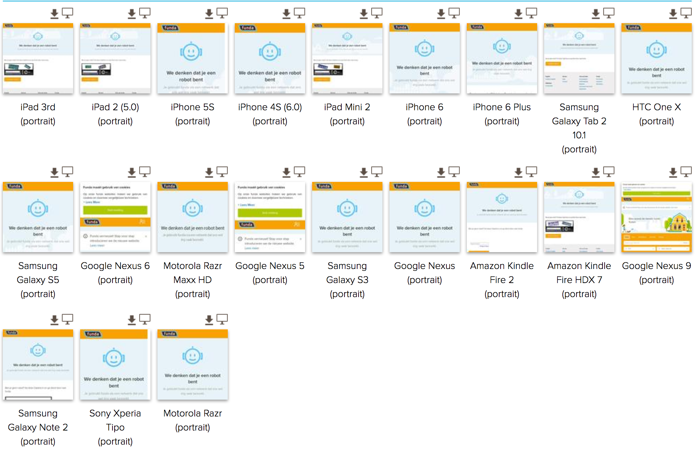
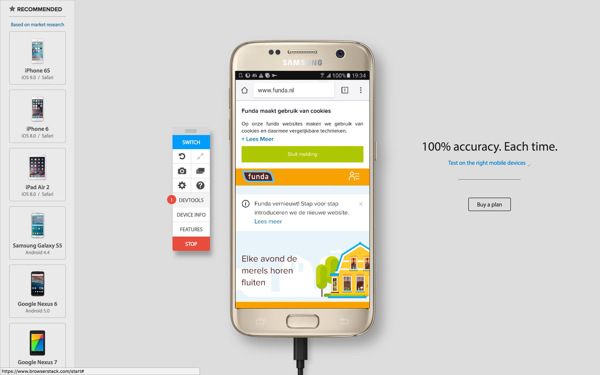
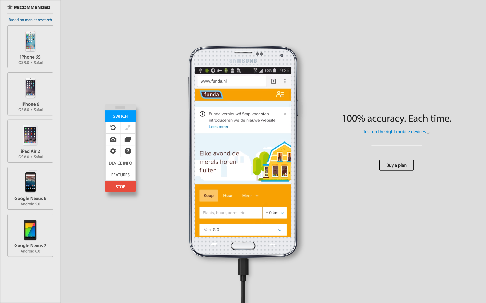

# Checking Funda's PE Usage

This document is a check of the [Funda website](http://funda.nl) which focusses on the following 8 features (or the lack there of):

1. [Images](#images)
2. [Custom Fonts](#custom-fonts)
3. [JavaScript](#javascript)
4. [Color](#color)
5. [Fast Internet](#fast-internet)
6. [Cookies](#cookies-localstorage)
7. [localStorage](#cookies-localstorage)
8. [Mouse / Trackpad](#mouse-trackpad)

## Images
Looking at images of realestate is a _major_ functionality and use-case of a realestate website. It's no surprise that the experience of looking for houses falls flat when images aren't allowed to be loaded.

|Page        | With images                                   | Without images                                          |
|------------|-----------------------------------------------|---------------------------------------------------------|
|Homepage    |  |  |
|Search      |  |  |
|Single item |    |    |

Note that all icons are images as well. Some options of the website are completely missing without these images. For example the button in the top right on the single item page is rendered useless and the 'share' buttons are missing.

_This was tested by disabling images under Settings > Advanced Settings > Content Settings > Images in Chrome Version 58.0.3029.110_

## Custom Fonts

Funda uses Googles Proxima Nova font for all it's copy. The font is being loaded asynchronously, with the system-default `sans-serif` font as fallback. This prevents a [FOIT](https://css-tricks.com/fout-foit-foft/). The `sans-serif` default on a Mac is actually quite similar in look and feel to Proxima Nova, so I didn't even notice the font missing the first time around.

_Home with custom font_  

_Home header without custom font_

_This was tested by removing the `fonts-loaded` class and throttling the network speed_

## JavaScript
Overall, the Funda website kinda works without JavaScript. There are some (major) features which plainly don't work — like the map view or the filter sidebar — but searching for and viewing real estate still works enough to be used properly. 

Whilst some features are missing, the most important interaction flow is still possible. You can still search for real estate from the homepage, select and view a single item and contact the realtor.

_This was tested by disabling JavaScript entirely under Settings > Advanced Settings > Content Settings > JavaScript in Chrome Version 58.0.3029.110_

## Color
The differences in colors are mostly good enough for people with colorblindness to be able to use the website without any problems. In general, the contrast between copy and background is good enough. There are some particular places where the contrast between text and backgroud color leaves something to be desired.

Next to the breadcrumbs, the labels of the general information about an item could prove a little hard to read for people with less-than-macbook-quality screens.

_Tested with [Sim Daltonism](https://itunes.apple.com/nl/app/sim-daltonism/id693112260?l=en&mt=12) and [Lea Verou's contrastratio](http://leaverou.github.io/contrast-ratio/#%23999999-on-white)_

## Fast Internet
Funda's website renders the page really nicely on slow connections. The assets are very well prioritized and the time to interactive is very quick, even on relatively bad connections. The custom font is — just like the JS bundle — load async, which results in a very fast meaningfull first paint. It is very clear that the developers kept mobile users on the move in mind when setting up this front-end.

_Loading of page on a 2G connection_

## Cookies / localStorage
Creating an account and logging in without cookies/localStorage completely broke the interaction on Funda's site. It didn't save my account registration and redirected me to a style-less error page. Registering / logging in with cookies/localStorage enabled works exactly as expected.

It seems like localStorage specifically is used mostly for tracking and user identification purposes.

_This was tested by checking the `Block sites from setting any data` options under Settings > Advanced Settings > Content Settings > Cookies in Chrome Version 58.0.3029.110_

## Mouse / Trackpad

---

## Device testing
Unfortunately, my automated tests across a great range of devices turned up empty because of Funda's robot-device blocking practices :(

Fortunately, [Browserstack](http://browserstack.com) allows me to test on these devices manually as well:

Funda's website remains very consistent across a range of devices. It draws a line at ie8 and below however. People who still use the 16yo Windows XP operating system will have a "suboptimal" experience.

