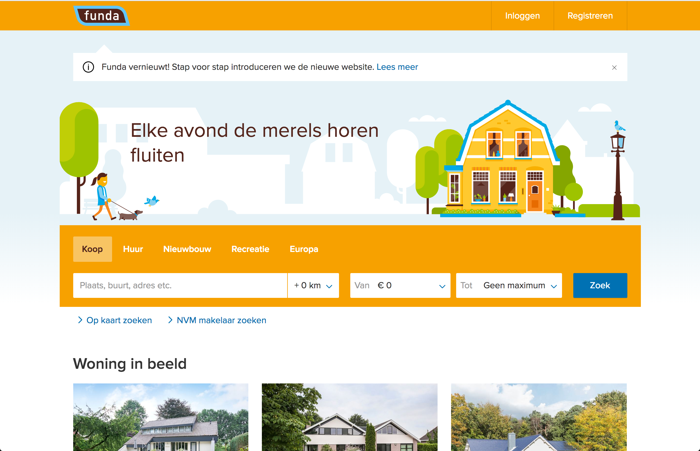
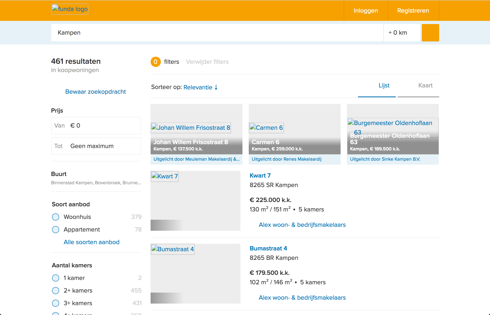
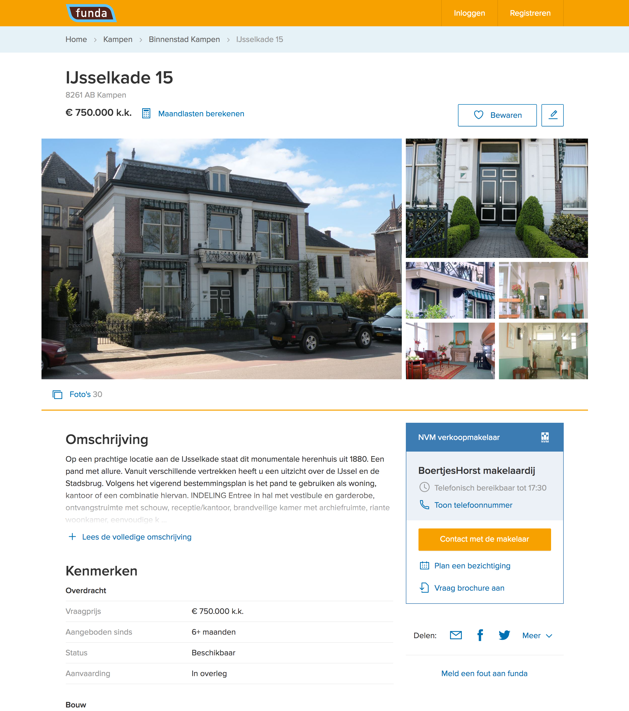
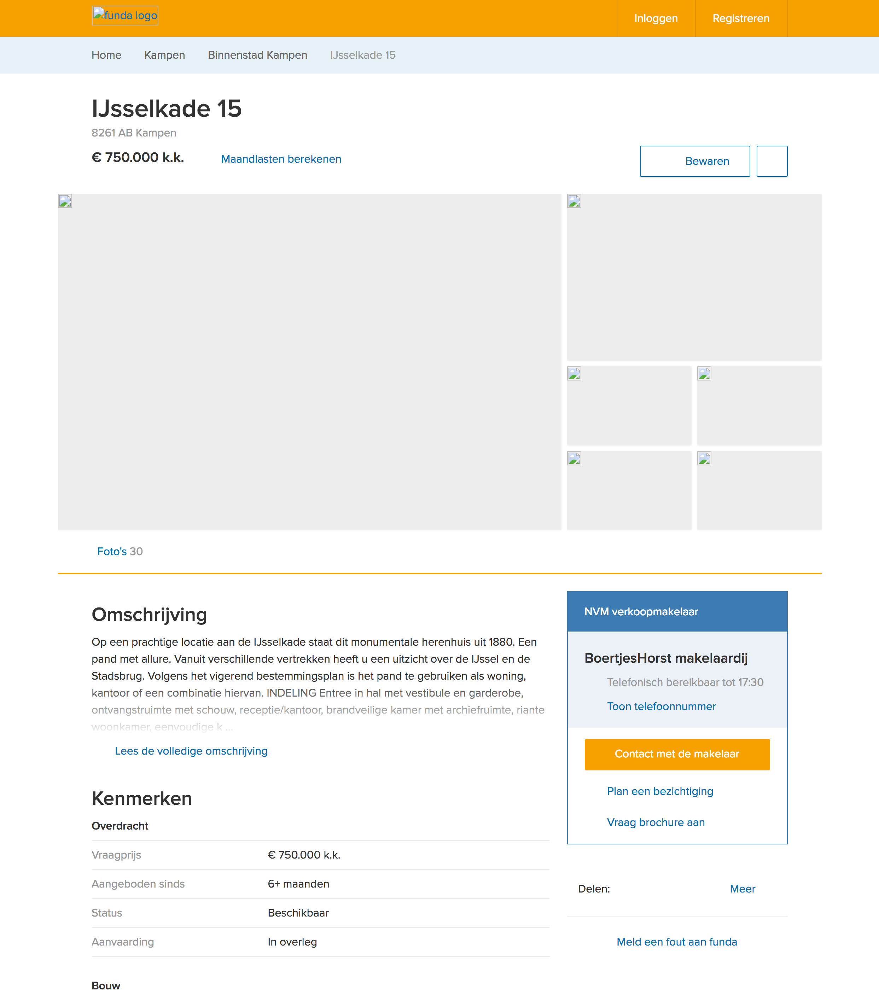

# Checking Funda's PE Usage

This document is a check of the [Funda website](http://funda.nl) which focusses on the following 8 features (or the lack there of):

1. [Images](#images)
2. [Custom Fonts](#custom-fonts)
3. [JavaScript](#javascript)
4. [Color](#color)
5. [Fast Internet](#fast-internet)
6. [Cookies](#cookies)
7. [localStorage](#localstorage)
8. [Mouse / Trackpad](#mouse-trackpad)

## Images
Looking at images of realestate is a _major_ functionality and use-case of a realestate website. It's no surprise that the experience of looking for houses falls flat when images aren't allowed to be loaded.

|Page        | With images                                   | Without images                                          |
|------------|-----------------------------------------------|---------------------------------------------------------|
|Homepage    |  |  |
|Search      |  |  |
|Single item |    |    |

Note that all icons are images as well. Some options of the website are completely missing without these images. For example the button in the top right on the single item page is rendered useless and the 'share' buttons are missing.
