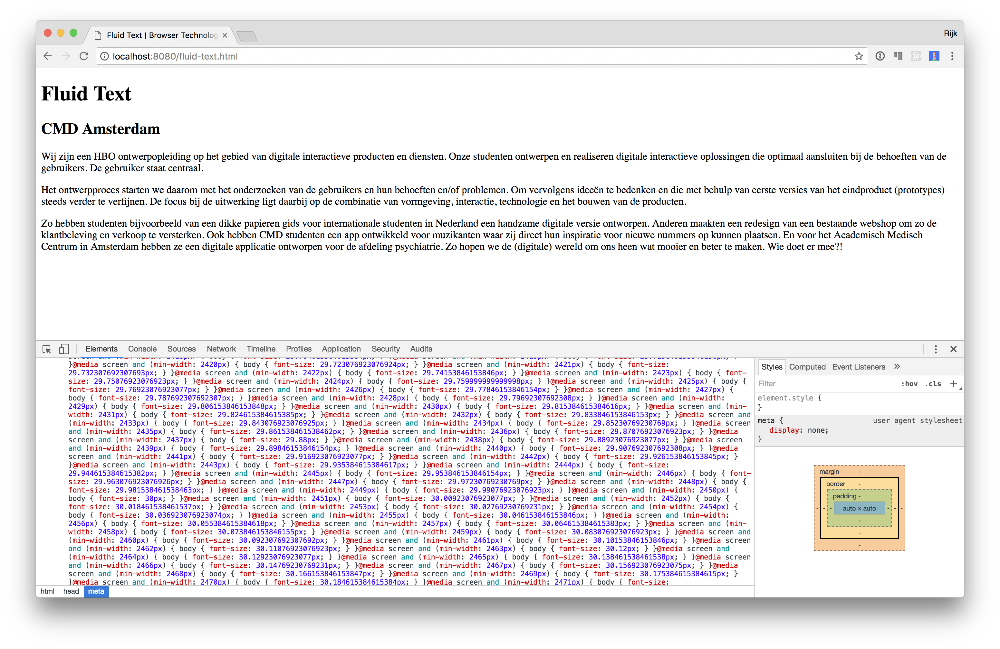
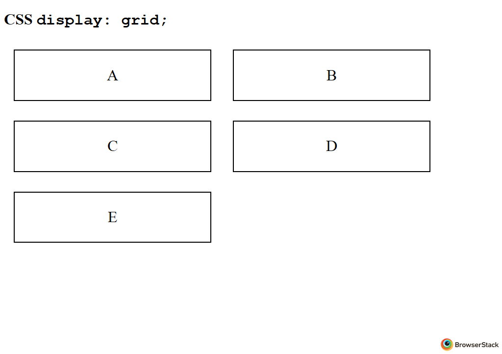
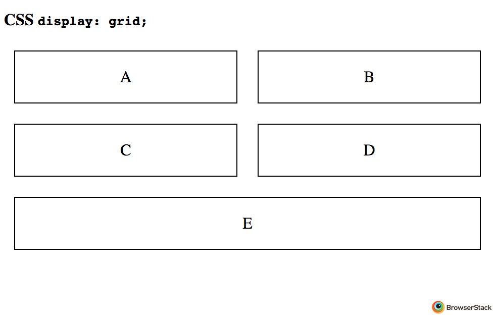
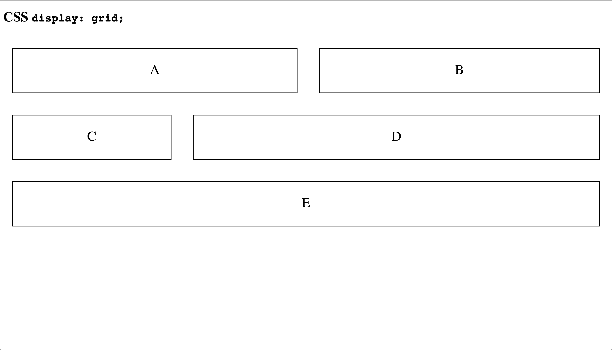

# Browser Technologies

## Details & Summary

[Live demo](https://rijkvanzanten/week2.github.io-bt/details-summary.html)

The `
` element can be used as a disclosure widget from which the user can retrieve additional information. This pattern is also known as a accordion.

### Sources
-  [MDN](https://developer.mozilla.org/en-US/docs/Web/HTML/Element/details)
-  [html5doctor](http://html5doctor.com/the-details-and-summary-elements/)

### Support
-  [ ] IE
-  [ ] Edge
-  [x] Firefox (49+)
-  [x] Chrome (49+)
-  [x] Safari (6+)
-  [x] Opera (15+)
-  [x] iOS Safari (6.1+)
-  [ ] Opera Mini
-  [x] Android Browser (4+)
-  [x] Chrome for Android

### Fallback
Browser which don't support the elements will ignore them and fall back to the contents inside the elements.

## Context Menu

[Live demo](https://rijkvanzanten.github.io/minor-bt/context-menu.html)

The `<menu>` and `<menuitem>` elements can be used in combination with the `context` type attribute to provide extra contextual options in the right-click-menu.

### Sources
-  [SitePoint](https://www.sitepoint.com/whats-new-in-html-5-1/)
-  [MDN](https://developer.mozilla.org/en-US/docs/Web/HTML/Element/menu)

### Support
-  [ ] IE
-  [ ] Edge
-  [x] Firefox (8+) (Partial)
-  [ ] Chrome (41+) (Flag)
-  [ ] Safari
-  [ ] Opera (35+) (Flag)
-  [ ] iOS Safari
-  [ ] Opera Mini
-  [ ] Android Browser
-  [ ] Chrome for Android

### Fallback
The contextual options should at all times be optional extras next to the regular controls. It isn't really possible to mimic the same functionality without overriding the right-click event and adding your own custom interface element (which is a big no-no usability and accessibility wise is you ask me).

## Fluid Text

[Live demo](https://rijkvanzanten.github.io/minor-bt/fluid-text.html)

In this demo I've used a combination of `calc()` and viewport relative units to scale the fontsize of the page in relation to the width of the viewport.

### Sources
-  [CSS-Tricks](https://css-tricks.com/viewport-sized-typography/)

### Support
-  [x] IE (9+)
-  [x] Edge
-  [x] Firefox (19+)
-  [x] Chrome (20+)
-  [x] Safari (6+)
-  [x] Opera (15+)
-  [x] iOS Safari (6.1+)
-  [ ] Opera Mini
-  [x] Android Browser (4.4+)
-  [x] Chrome for Android

### Fallback
The font-size will automatically fall back to the default font-size when the browser doesn't support `calc` or `vw`. This behavior is fine for most use cases. I have created a little snippet to make this effect possible on older browsers also. The first fallback implementation was to create a `@media` query for each possible viewport width (1 ... 2560) (capped at ultrawide full hd) and increase the font-size accordingly.

This worked beautifully. Too bad *media queries aren't supported in browser which don't support calc*. ~~Derp~~

The second attempt is adding a event listener to the window and updating the font-size in JS on every change of the viewport. Pretty nasty stuff, not really necessary or all that useful. Fun to mess around with nonetheless.

## Grid

[Live demo](https://rijkvanzanten.github.io/minor-bt/grid.html)

CSS Grid Layout is a very powerful layout system available in CSS. It is a 2-dimensional system (columns & rows).

### Sources
-  [CSS-Tricks](https://css-tricks.com/snippets/css/complete-guide-grid/)
-  [The many many tweets of @rachelandrew](https://twitter.com/rachelandrew)

### Support
-  [ ] IE (old spec)
-  [ ] Edge (old spec)
-  [x] Firefox (52+)
-  [x] Chrome (57+)
-  [x] Safari (10.1+)
-  [x] Opera (44+)
-  [ ] iOS Safari
-  [ ] Opera Mini
-  [ ] Android Browser
-  [ ] Chrome for Android

### Fallback
Modern browsers which don't support Grid will fallback to a flexbox layout. Browsers which don't support flexbox will fallback to a inline-block layout.

_inline block_

_flexbox_

_grid_

## Notifications
[Live demo](https://rijkvanzanten.github.io/minor-bt/notifications.html)

The Notifications API allows web pages to send system notifications to the end user. The notifications are outside the top-level browsing context viewport, so can be displayed even when the user doesn't have the browser window opened.

### Sources
-  [MDN](https://developer.mozilla.org/nl/docs/Web/API/notification)
-  [html5rocks](https://www.html5rocks.com/en/tutorials/notifications/quick/)

### Support
-  [ ] IE
-  [x] Edge (14+)
-  [x] Firefox (2+)
-  [x] Chrome (22+)
-  [x] Safari (6+)
-  [x] Opera (25+)
-  [ ] iOS Safari
-  [ ] Opera Mini
-  [ ] Android Browser
-  [ ] Chrome for Android

### Fallback
Browsers which don't support the Notifications API will receive alerts instead of notifications. Modern browsers won't focus the window when an alert comes in but on older browsers this behavior is still available.

## Bluetooth API
[Live demo](https://rijkvanzanten.github.io/minor-bt/bluetooth.html)

The Bluetooth API allows websites to communicate with nearby Bluetooth devices. Heart rate monitors, smart lightbulbs, drones etc etc etc could interact directly with a website.

This demo allows you to connect your phone and monitor your batterylevel in real time.

### Sources
-  [Google Developers](https://developers.google.com/web/updates/2015/07/interact-with-ble-devices-on-the-web)

### Support
-  [ ] IE
-  [ ] Edge
-  [ ] Firefox
-  [x] Chrome [(Mac only for now)](https://github.com/WebBluetoothCG/web-bluetooth/blob/gh-pages/implementation-status.md)
-  [ ] Safari
-  [x] Opera [(Mac only for now)](https://github.com/WebBluetoothCG/web-bluetooth/blob/gh-pages/implementation-status.md)
-  [ ] iOS Safari
-  [ ] Opera Mini
-  [ ] Android Browser
-  [x] Chrome for Android (Varies by OS)

### Fallback
...... gl;hf  
The only real fallback would be physically looking at your phone. I can't think of a way of getting a similar result otherwise.
